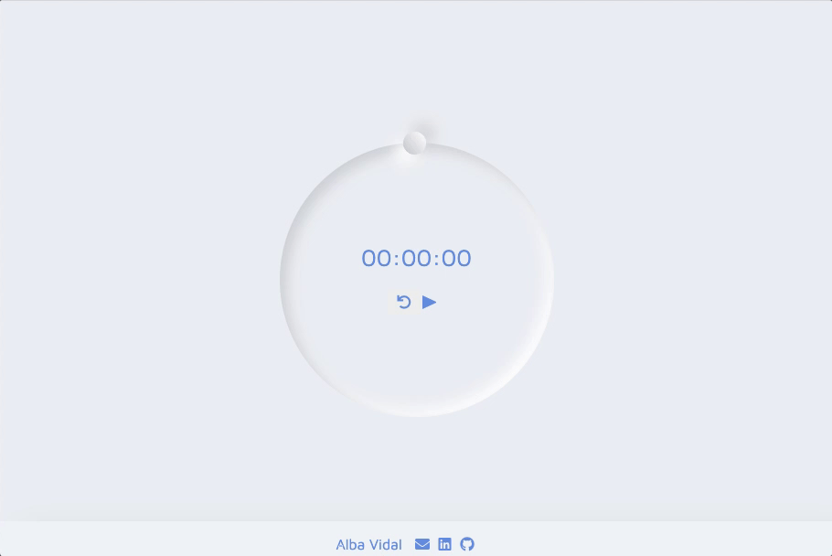

# Chronometer / Stopwatch

## Table of contents

- [Overview](#overview)
  - [The challenge](#the-challenge)
  - [Stage](#stage-🏗)
  - [Screenshots](#screenshots)
  - [Links](#links)
- [My process](#my-process)
  - [Built with](#built-with)
  - [What I learned](#what-i-learned)
- [Author](#author)
- [Support](#🖤-support)

## Overview

### The challenge

- An interactive stopwatch using HTML, CSS and JavaScript
- Animate and toggle the Play/Pause button depending on its state
- Animate the second hand ball and pause its animation depending on the Play/Pause state
- Reset the time and the second hand ball when clicking the Reset button

### Stage 🏗

I wanted to code a very minimalist stopwatch in design and functionality, so this repository is finished at the moment. In a future (when I have more skills) I'll come back to minimize the code.

### Screenshots

### Links

- Code: [https://github1s.com/albavidalm/Chronometer](https://github1s.com/albavidalm/Chronometer)

- Live Site URL: [https://albavidalm.github.io/Chronometer/](https://albavidalm.github.io/Chronometer/)

## My process

### Built with

- Semantic HTML5 markup
- CSS with Neumorphism
- Flexbox
- Animations
- JavaScript

### What I learned

I refreshed my CSS, and JavaScript skills and experimented with the Neumorphism.

This practice has helped me to have a better understanding of nested conditionals, advanced Dom Scripting and animations.

## Author

- GitHub: [https://github.com/albavidalm](https://github.com/albavidalm)
- Email: [albavidalm @ gmail.com](mailto:albavidalm@gmail.com?subject=Hi)
- Linkedin: [https://www.linkedin.com/in/albavidalm/](https://www.linkedin.com/in/albavidalm/)

## 🖤 Support

Sharing is caring, contributions and suggestions are always welcome.
